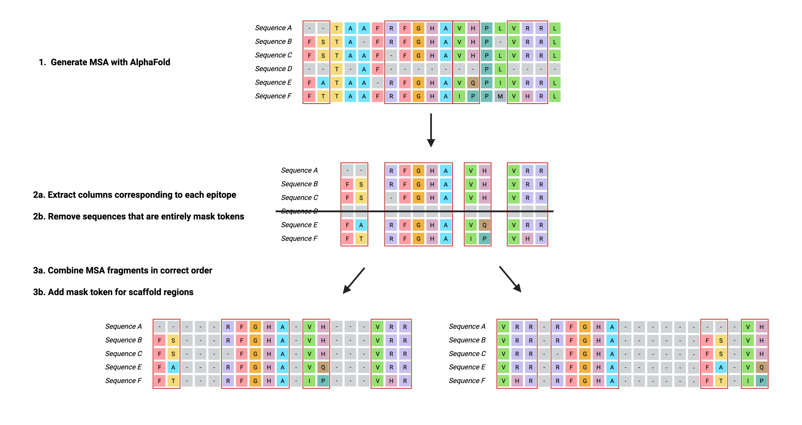
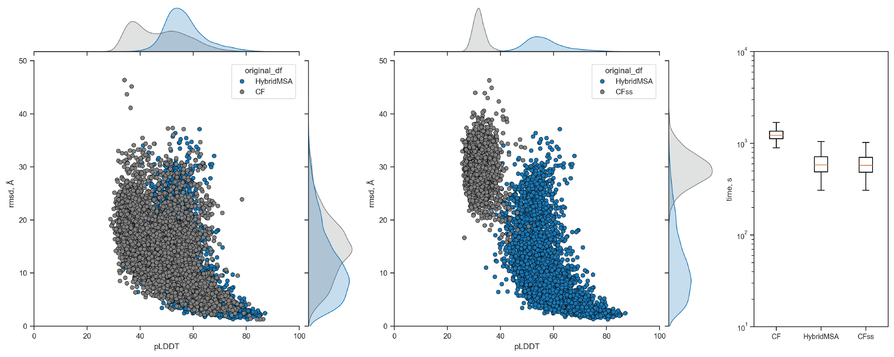

# HybridMSA

HybridMSA is a versatile C++ tool for generating customized multiple sequence alignments (MSAs) for proteins — especially those produced via deep learning-driven motif scaffolding pipelines, though it supports a range of other use cases including fusion/chimeric proteins, tagged proteins, and more!

## How HybridMSA works

HybridMSA processes MSAs (e.g. from AlphaFold2 or other sources) and generates HybridMSAs that:

- Retain evolutionary information where available

- Insert masked tokens elsewhere

- Support downstream applications (e.g., structure prediction using ColabFold's implementation of AlphaFold2)

Importantly, this enables confident and accurate structure prediction for engineered proteins that would otherwise be unsupported or poorly modeled by AlphaFold2.

## Why use HybridMSA?

Tool's relying on MSAs (e.g. AlphaFold2) often fail or perform poorly when:

- A protein includes *de novo* designed regions,

- The protein is a chimera or fusion,

- Tags (e.g., purification tags) are added,

- Genetic searches return no meaningful hits.

HybridMSA solves these issues by seperating genetic searching and MSA generation, enabling the combination of meaningful evolutionary content with masked regions such that the performance of AlphaFold2 increases tremendously.

## Benchmarking HybridMSA

In a benchmarking case of 1000 motif scaffolds generated via a deep learning-driven protein design pipeline, HybridMSA outperformed ColabFold's implementation of AlphaFold2 under default settings (CF) and single-sequence mode (CFss) with regard to accuracy and confidence of predicted models. We attribute this to HybridMSA’s ability to preserve evolutionary context while avoiding  noisy or misleading genetic searches for artificial regions. In addition, HybridMSA  enables the bypassing of time-consuming genetic and structural database searches, decreasing structure predicton time significantly compared to CF.

## Installation
Follow the steps below to install dependencies and compile the source code.

1. Download reformat.pl

	HybridMSA relies on HH-suite’s [reformat.pl](https://github.com/soedinglab/hh-suite/blob/master/scripts/reformat.pl) to standardize MSA formats.

2. Compile the three C++ utility programs

	g++ -std=c++17 src/parse_msa_bfd_only.cpp -o parse_msa_bfd_only

	g++ -std=c++17 src/prepare_msa_A.cpp -o prepare_msa_A -lstdc++fs

	g++ -std=c++17 src/prepare_msa_B.cpp -o prepare_msa_B

## Usage

**parse_msa_bfd_only** processes the BFD MSA (in A3M format) from AlphaFold2 genetic searching to extract specific contiguous regions (contigs) from each aligned sequence; these contigs are specified by exact substring matches to the query (first) sequence, and the resulting sub-alignments are saved for downstream use. While it is optimized for BFD-style A3M inputs, the program is format-flexible and supports any input readable by reformat.pl, including: fas, a2m, a3m, sto, psi, clu.

Usage: ./parse_msa_bfd_only /path/to/msas/directory contig1 [contig2] ...

- <reformat.pl>: Path to the reformat.pl script from HH-suite

- <msa_dir>: Path to the directory containing bfd_uniclust_hits.a3m

- <contigX>: Substring(s) to extract from aligned sequences

**prepare_msa_A** generates a HybridMSA for the first sequence in an input FASTA file by aligning each specified contig exactly to its corresponding position within the full input sequence and then filling all other (non-contig) positions with masked tokens to indicate missing or unaligned regions. This approach enables rapid construction of MSAs even when contigs occur in arbitrary positions or in different orders within the input sequences, by preserving positional accuracy and marking gaps clearly. Each sequence within the input FASTA file should be the same length and contigs should be in the same positions (e.g. output FASTA file from ProteinMPNN).

Usage: ./prepare_msa_A input_file.fasta /path/to/output/of/run_divide_msa_bfd_only/directory contig1 [contig2] ...

- <input_fasta>: Path to the input FASTA file containing full-length sequences

- <msa_dir>: Directory containing sub-alignments for each contig (e.g., contig1.txt, contig2.txt)

- <contigX>: One or more substring(s) defining contigs to align and assemble into a HybridMSA

**prepare_msa_B** generates a HybridMSA for each sequence in an input FASTA file with proper formatting for ColabFold input by prepending sequence-specific headers to the A3M file output from prepare_msa_A. It supports different cardinalities (e.g., "monomer" or "homotrimer") and formats output filenames accordingly.

Usage: ./prepare_msa_B input_file.fasta fasta_file a3m_file cardinality

- <input_fasta>: Path to the input FASTA file containing full-length sequences

- <a3m_file>: Path to the output A3M file from prepare_msa_A corresponding to the input FASTA file

- <cardinality>: Specifies assembly type, e.g., "monomer" or "homotrimer"

## Citation
This method is described in a recent publication: Kriews and Agostino, et al. (2025)

Please cite this work if you use HybridMSA in your research!
